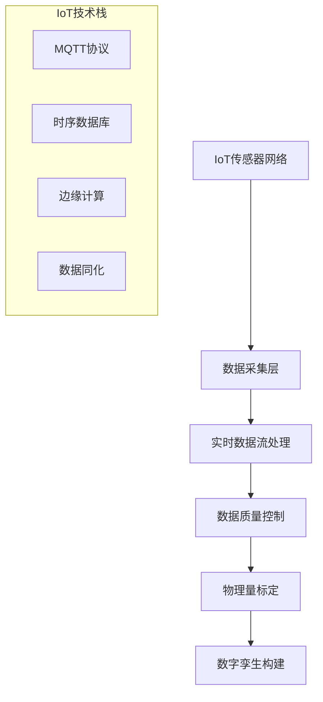
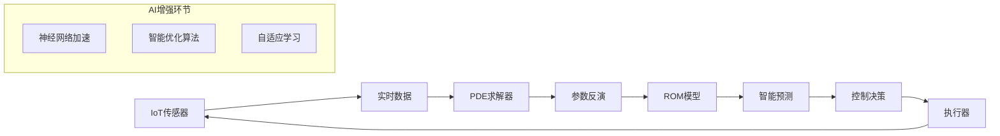

# 🧠 DeepCAD物理AI模块重构技术规范

## 📋 **任务指令书**
**指令发起**: 1号首席架构师  
**执行负责**: 3号物理计算专家  
**任务优先级**: 🔥 HIGH  
**完成时间**: 1周内提交技术方案  

---

## 🎯 **重构目标**

### **现状分析**
当前物理AI模块功能分散，缺乏统一的物理计算架构。需要整合：
- IoT数据采集和处理架构
- 基于PDE约束的优化反演算法
- ROM (Reduced Order Model) 降阶模型
- 物理场预测和智能优化

### **目标架构**
构建统一的**智能物理计算平台**，集成现代计算物理学方法和AI技术。

---

## 🏗️ **核心技术架构**

### **1. IoT数据融合架构**


**技术要求**:
- **实时数据采集**: 支持1000+传感器并发
- **数据协议**: MQTT、CoAP、HTTP
- **时序数据库**: InfluxDB、TimescaleDB
- **边缘计算**: 现场数据预处理和异常检测

### **2. PDE约束优化反演系统**
```python
class PDEConstrainedOptimization:
    """基于PDE约束的物理参数反演系统"""
    
    def __init__(self):
        self.pde_solver = KratosMultiphysics()
        self.optimization_engine = SciPyOptimize()
        self.adjoint_solver = AdjointSolver()
        
    # 核心算法架构
    algorithms = {
        "forward_problem": {
            "description": "正向PDE求解",
            "methods": ["FEM", "FVM", "FDM"],
            "solver": "Kratos Multiphysics",
            "parallel": "MPI + OpenMP"
        },
        
        "inverse_problem": {
            "description": "参数反演",
            "methods": ["梯度下降", "遗传算法", "贝叶斯优化"],
            "constraint": "PDE物理约束",
            "regularization": "Tikhonov正则化"
        },
        
        "adjoint_method": {
            "description": "伴随方法求梯度",
            "advantage": "高效梯度计算",
            "implementation": "自动微分 + 手工推导"
        },
        
        "uncertainty_quantification": {
            "description": "不确定性量化",
            "methods": ["蒙特卡洛", "多项式混沌", "贝叶斯推断"],
            "output": "参数置信区间"
        }
    }
```

**算法流程**:
1. **观测数据输入** → 传感器测量值
2. **正向PDE求解** → 给定参数下的物理场
3. **目标函数构建** → |u_computed - u_observed|²
4. **伴随方程求解** → 高效梯度计算
5. **优化迭代** → 参数更新直至收敛
6. **不确定性分析** → 参数可信度评估

### **3. ROM降阶模型系统**
```python
class ReducedOrderModel:
    """物理系统降阶建模"""
    
    # ROM技术栈
    rom_methods = {
        "POD": {
            "name": "本征正交分解",
            "application": "线性系统降阶",
            "basis": "SVD特征向量",
            "efficiency": "高速求解"
        },
        
        "DMD": {
            "name": "动态模态分解", 
            "application": "非线性动力学",
            "basis": "Koopman算子特征函数",
            "prediction": "时序预测"
        },
        
        "PROM": {
            "name": "参数化降阶模型",
            "application": "多参数优化",
            "basis": "参数空间插值",
            "adaptivity": "自适应基函数"
        },
        
        "Physics_Informed_ROM": {
            "name": "物理信息降阶模型",
            "application": "保持物理约束",
            "constraint": "守恒律嵌入",
            "accuracy": "高保真降阶"
        }
    }
    
    def build_rom_pipeline(self):
        """构建ROM计算管线"""
        return {
            "data_collection": "高保真仿真数据采集",
            "snapshot_generation": "解快照矩阵构建", 
            "basis_extraction": "主成分/模态提取",
            "rom_construction": "降阶方程组装",
            "online_prediction": "实时快速预测",
            "error_estimation": "误差控制和适应"
        }
```

**ROM应用场景**:
- **实时控制**: 毫秒级物理场预测
- **参数扫描**: 快速设计空间探索  
- **优化设计**: 高效目标函数评估
- **数字孪生**: 实时系统状态估计

### **4. 智能预测系统**
```python
class PhysicsInformedPrediction:
    """物理信息神经网络预测系统"""
    
    prediction_stack = {
        "PINN": {
            "name": "物理信息神经网络",
            "architecture": "深度神经网络 + PDE损失",
            "advantage": "无需标记数据",
            "application": "复杂几何求解"
        },
        
        "DeepONet": {
            "name": "深度算子网络",
            "architecture": "Trunk + Branch网络",
            "capability": "函数到函数映射",
            "application": "算子学习"
        },
        
        "Graph_Neural_Network": {
            "name": "图神经网络",
            "architecture": "GCN/GraphSAGE",
            "advantage": "网格自适应",
            "application": "不规则网格预测"
        },
        
        "Transformer_PDE": {
            "name": "Transformer求解器",
            "architecture": "注意力机制",
            "advantage": "长距离依赖",
            "application": "时空序列预测"
        }
    }
```

---

## 🎮 **界面设计规范**

### **主界面布局**
```typescript
interface PhysicsAIInterface {
  // 顶部控制栏
  control_panel: {
    iot_status: "IoT连接状态",
    computation_mode: "计算模式选择",
    model_selector: "物理模型选择",
    real_time_toggle: "实时/离线模式"
  };
  
  // 左侧配置面板
  configuration: {
    iot_config: "IoT数据源配置",
    pde_setup: "PDE方程设置", 
    optimization_params: "优化参数配置",
    rom_settings: "ROM模型设置"
  };
  
  // 中央工作区
  workspace: {
    geometry_view: "几何模型显示",
    field_visualization: "物理场可视化",
    convergence_monitor: "收敛性监控",
    prediction_display: "预测结果展示"
  };
  
  // 右侧分析面板
  analysis: {
    parameter_history: "参数演化历史",
    uncertainty_bounds: "不确定性区间",
    model_accuracy: "模型精度评估",
    computation_stats: "计算性能统计"
  };
}
```

### **数据流可视化**


---

## 📊 **技术指标要求**

### **性能指标**
| 指标 | 目标值 | 说明 |
|------|--------|------|
| **IoT数据吞吐** | 10,000 points/sec | 支持大规模传感器网络 |
| **PDE求解速度** | <10秒 | 中等规模问题实时求解 |
| **ROM加速比** | 100-1000x | 相对于全阶模型 |
| **预测精度** | >95% | 在验证数据集上 |
| **参数收敛** | <50次迭代 | 典型反演问题 |

### **算法精度**
| 算法类型 | 精度要求 | 验证方法 |
|----------|----------|----------|
| **PDE求解** | 相对误差<1% | 解析解对比 |  
| **参数反演** | 参数误差<5% | 合成数据验证 |
| **ROM模型** | 能量误差<0.1% | POD模态截断 |
| **AI预测** | RMSE<2% | 交叉验证 |

---

## 🔧 **实现技术栈**

### **后端计算引擎**
```python
backend_stack = {
    "physics_solver": {
        "kratos": "多物理场有限元框架",
        "fenics": "PDE求解库", 
        "openfoam": "CFD专用求解器",
        "dealii": "高性能有限元库"
    },
    
    "optimization": {
        "scipy": "经典优化算法",
        "optuna": "贝叶斯优化",
        "pymoo": "多目标优化",
        "jax": "自动微分优化"
    },
    
    "ml_framework": {
        "pytorch": "深度学习主框架",
        "jax": "高性能科学计算",
        "tensorflow": "生产级部署",
        "scikit_learn": "经典机器学习"
    },
    
    "data_processing": {
        "numpy": "数值计算基础",
        "scipy": "科学计算库",
        "pandas": "数据处理",
        "xarray": "多维数据处理"
    }
}
```

### **前端可视化**
```typescript
frontend_stack = {
  "3d_visualization": {
    "threejs": "3D场景渲染",
    "vtk": "科学可视化",
    "plotly": "交互式图表",
    "d3": "自定义可视化"
  },
  
  "real_time_display": {
    "websocket": "实时数据传输",
    "webgl": "GPU加速渲染", 
    "webworker": "后台计算",
    "streaming": "数据流处理"
  },
  
  "ui_framework": {
    "react": "界面框架",
    "antd": "UI组件库",
    "framer_motion": "动画效果",
    "styled_components": "样式管理"
  }
}
```

---

## 🎯 **开发里程碑**

### **第一阶段 (Week 1): 架构设计**
- [ ] 完善技术方案文档
- [ ] 确定数据流架构  
- [ ] 设计API接口规范
- [ ] 制定开发计划

### **第二阶段 (Week 2-3): 核心算法**
- [ ] 实现PDE约束优化算法
- [ ] 开发ROM降阶模型系统
- [ ] 集成IoT数据处理管线  
- [ ] 构建AI预测模型

### **第三阶段 (Week 4): 界面集成**
- [ ] 开发物理AI主界面
- [ ] 实现实时数据可视化
- [ ] 集成计算监控面板
- [ ] 完成用户交互逻辑

### **第四阶段 (Week 5): 测试优化**
- [ ] 算法精度验证
- [ ] 性能基准测试
- [ ] 用户体验优化
- [ ] 文档编写完善

---

## 📋 **交付要求**

### **技术文档**
1. **详细设计文档** - 算法原理和实现细节
2. **API接口文档** - 前后端接口规范
3. **用户使用手册** - 操作指南和案例
4. **性能测试报告** - 基准测试结果

### **代码实现**
1. **后端算法模块** - Python科学计算代码
2. **前端界面组件** - React/TypeScript界面
3. **数据处理管线** - IoT数据流处理
4. **集成测试用例** - 完整的测试套件

### **演示案例**
1. **深基坑IoT监控** - 实际工程案例演示
2. **参数反演验证** - 合成数据验证
3. **ROM加速对比** - 性能提升展示
4. **AI预测准确性** - 预测精度验证

---

## 🚀 **预期成果**

通过本次重构，物理AI模块将成为：
- 🧠 **智能化程度最高**的CAE计算平台
- ⚡ **性能最优**的实时物理仿真系统  
- 🔗 **集成度最佳**的IoT-AI-CAE解决方案
- 🎯 **用户体验最好**的物理计算界面

---

**最终目标**: 打造世界级的智能物理计算平台，引领CAE行业技术发展！

---

*1号首席架构师 技术指令*  
*DeepCAD物理AI重构项目*  
*2024年7月25日*