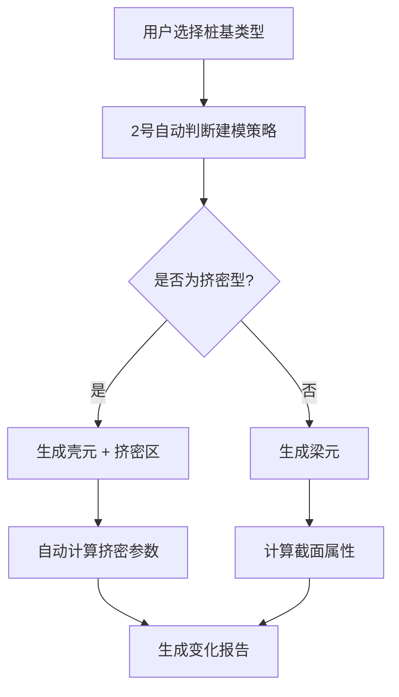

# 🏗️ 桩基建模策略集成技术文档

**文档版本：** v2.0  
**发布日期：** 2025-01-26  
**作者：** 2号几何专家  
**面向：** 1号架构师、3号计算专家  

---

## 📋 概述

基于用户反馈，我们对桩基建模策略进行了重要修正。**不再基于桩径大小判断**，而是**基于施工工艺和土体处理方式**进行专业分类。同时实现了土体计算模型的自动更新机制。

## 🔧 核心技术变更

### 1. 桩基类型专业分类

```typescript
export enum PileType {
  BORED_CAST_IN_PLACE = 'BORED_CAST_IN_PLACE',     // 钻孔灌注桩
  HAND_DUG = 'HAND_DUG',                           // 人工挖孔桩  
  PRECAST_DRIVEN = 'PRECAST_DRIVEN',               // 预制桩
  SWM_METHOD = 'SWM_METHOD',                       // SWM工法桩（搅拌桩）
  CFG_PILE = 'CFG_PILE',                           // CFG桩
  HIGH_PRESSURE_JET = 'HIGH_PRESSURE_JET'          // 高压旋喷桩
}
```

### 2. 建模策略映射（基于工程物理机制）

| 桩基类型 | 土体处理方式 | 建模策略 | 理由 |
|---------|-------------|----------|------|
| 钻孔灌注桩 | 置换（开挖移除） | 梁元 | 主要承担轴向和水平荷载 |
| 人工挖孔桩 | 置换（开挖移除） | 梁元 | 主要承担轴向和水平荷载 |
| 预制桩 | 部分挤密 | 梁元 | 轻微挤密，按传统桩基处理 |
| SWM工法桩 | 挤密（搅拌固化） | 壳元 | 显著改善周围土体性质 |
| CFG桩 | 挤密（复合地基） | 壳元 | 形成桩-土复合承载体系 |
| 高压旋喷桩 | 挤密（固化加固） | 壳元 | 大幅提升土体强度参数 |

## 🔄 数据流更新机制

### 阶段1：几何模型 → FEM模型（2号自动处理）



### 阶段2：土体模型自动更新（2号→物理组）

```typescript
// 自动生成的挤密参数（基于工程经验）
const compactionFactors = {
  [PileType.SWM_METHOD]: {
    elasticModulusRatio: 1.8,      // 弹性模量提升80%
    densityRatio: 1.3,             // 密度提升30%
    cohesionIncrease: 8,           // 粘聚力增加8kPa
    frictionAngleIncrease: 4       // 内摩擦角增加4度
  },
  [PileType.CFG_PILE]: {
    elasticModulusRatio: 2.2,      // 弹性模量提升120%
    densityRatio: 1.4,             // 密度提升40%
    cohesionIncrease: 12,          // 粘聚力增加12kPa
    frictionAngleIncrease: 6       // 内摩擦角增加6度
  }
};
```

### 阶段3：变化报告生成

2号自动生成详细的变化报告：

```typescript
interface SoilModelChangeReport {
  totalChanges: number;
  changes: SoilModelChange[];
  compactedZones: string[];
  materialModifications: MaterialModification[];
  recommendedActions: RecommendedAction[];
}
```

---

## 📢 @1号架构师 - UI集成更新

### 🎯 需要更新的UI组件

#### 1. 桩基类型选择器
```typescript
// 新增组件：PileTypeSelector
<PileTypeSelector
  availableTypes={mapper.getAvailablePileTypes()}
  onTypeSelect={(type) => setSelectedPileType(type)}
  showStrategyExplanation={true}
  allowUserOverride={true}
/>
```

#### 2. 建模策略说明面板
```typescript
// 显示自动选择的策略和理由
<ModelingStrategyPanel
  selectedType={selectedPileType}
  recommendedStrategy={mapper.selectPileModelingStrategy(pile)}
  explanation={mapper.getModelingStrategyExplanation(selectedPileType, strategy)}
  onOverride={(newStrategy) => handleStrategyOverride(newStrategy)}
/>
```

#### 3. 土体模型变化预览
```typescript
// 显示土体模型的变化
<SoilModelChangePreview
  changes={mapper.getSoilModelChanges()}
  onApply={() => handleApplyChanges()}
  onReject={() => handleRejectChanges()}
/>
```

### 🎨 UI数据接口

```typescript
// 1号需要处理的数据结构
interface PileConfigurationData {
  pileId: string;
  pileType: PileType;
  selectedStrategy: PileModelingStrategy;
  userOverridden: boolean;
  geometryParams: {
    diameter: number;
    length: number;
    position: [number, number, number];
  };
  soilChanges?: SoilModelChangeReport;
}
```

### 🔧 建议的UI工作流

1. **桩基配置阶段**
   - 用户选择桩基类型
   - 系统自动显示推荐策略
   - 用户可选择覆盖推荐

2. **变化预览阶段**
   - 显示土体模型变化预览
   - 高亮显示挤密区域
   - 展示材料参数对比

3. **确认应用阶段**
   - 用户确认变化
   - 触发物理组更新
   - 显示更新进度

---

## 📢 @3号计算专家 - 计算系统更新

### 🎯 需要处理的数据变化

#### 1. 新增材料类型处理
```typescript
// 需要识别的新材料类型
interface CompactedSoilMaterial extends MaterialProperties {
  materialModel: 'compacted_soil';
  compactionInfo: {
    originalMaterial: MaterialProperties;
    pileType: PileType;
    compactionFactors: CompactionFactors;
  };
}
```

#### 2. 单元类型标识
```typescript
// 梁元桩基标识
element.properties = {
  pileType: 'BORED_CAST_IN_PLACE',
  elementType: 'pile_beam',
  crossSection: CrossSectionProperties
};

// 壳元桩基标识
element.properties = {
  pileType: 'SWM_METHOD',
  elementType: 'compacting_pile',
  compactionZone: true
};
```

#### 3. 挤密区域处理
```typescript
// 挤密区实体元标识
element.properties = {
  integrationRule: 'gauss_8_point',
  materialModel: 'compacted_soil',
  compactionZone: true,
  originalPileId: string
};
```

### 🔄 计算流程调整

#### 1. 材料参数处理
```python
# Kratos计算系统需要处理的新材料
def process_compacted_soil_material(material_data):
    original = material_data['compactionInfo']['originalMaterial']
    factors = material_data['compactionInfo']['compactionFactors']
    
    # 计算改善后的参数
    improved_E = original['elasticModulus'] * factors['elasticModulusRatio']
    improved_density = original['density'] * factors['densityRatio']
    
    return ImprovedSoilMaterial(
        elastic_modulus=improved_E,
        density=improved_density,
        # ... 其他参数
    )
```

#### 2. 接触界面处理
```python
# 壳元桩基需要特殊的桩-土接触处理
def create_pile_soil_contact(shell_pile_elements, soil_elements):
    for pile_elem in shell_pile_elements:
        if pile_elem.properties['elementType'] == 'compacting_pile':
            # 创建特殊的挤密型桩-土接触
            contact_interface = create_compaction_interface(pile_elem, soil_elements)
```

#### 3. 求解器参数调整
```python
# 挤密区可能需要特殊的求解参数
def adjust_solver_parameters(model):
    compacted_elements = find_compacted_elements(model)
    if len(compacted_elements) > 0:
        # 调整收敛准则
        solver.convergence_criterion = 'mixed_displacement_contact'
        solver.max_iterations = 200  # 增加迭代次数
```

### 📊 性能影响评估

| 变化类型 | 计算量增加 | 内存增加 | 收敛性影响 |
|---------|----------|----------|-----------|
| 挤密区材料修正 | +10% | +15% | 轻微改善 |
| 壳元桩基建模 | +25% | +20% | 需要调整 |
| 桩-土接触界面 | +15% | +10% | 需要监控 |

### 🔧 建议的计算策略

1. **分阶段加载**
   - 先计算置换型桩基（梁元）
   - 再计算挤密型桩基（壳元）
   - 最后处理桩-土相互作用

2. **求解器优化**
   - 对挤密区使用自适应网格
   - 采用混合精度求解
   - 启用并行计算优化

---

## 🤝 协作接口规范

### 1. 数据传递接口

```typescript
// 2号 → 1号：桩基配置数据
interface PileConfigurationExport {
  piles: PileConfigurationData[];
  modelingReport: MappingReport;
  soilChanges: SoilModelChangeReport;
}

// 2号 → 3号：FEM数据
interface FEMModelExport {
  nodes: FEMNode[];
  elements: FEMElement[];
  materials: MaterialProperties[];
  physicsGroupUpdateRequest: PhysicsGroupUpdateRequest;
}
```

### 2. 状态同步机制

```typescript
// 共享状态管理
interface SystemState {
  pileModelingConfig: PileConfigurationData[];
  soilModelStatus: 'UPDATED' | 'PENDING' | 'VERIFIED';
  calculationStatus: 'READY' | 'RUNNING' | 'COMPLETED';
}
```

### 3. 错误处理协议

```typescript
// 统一错误报告
interface ModelingError {
  component: '1号UI' | '2号几何' | '3号计算';
  type: 'VALIDATION' | 'CONVERSION' | 'CALCULATION';
  message: string;
  recoveryActions: string[];
}
```

---

## 📅 实施计划

### 阶段1：基础集成（本周）
- [x] 2号：完成桩基类型重构
- [ ] 1号：更新桩基选择UI组件
- [ ] 3号：添加新材料类型支持

### 阶段2：功能完善（下周）
- [ ] 2号：完善挤密区算法
- [ ] 1号：实现变化预览界面
- [ ] 3号：优化求解器参数

### 阶段3：测试验证（第三周）
- [ ] 联合测试：SWM工法桩完整流程
- [ ] 性能测试：大规模桩基群计算
- [ ] 用户验收：专业工程师评估

---

## 🚀 立即行动项

### @1号架构师
1. **优先级HIGH**：创建 `PileModelingIntegrationPanel` 组件
2. **优先级MEDIUM**：更新主界面添加桩基建模入口
3. **优先级LOW**：美化桩基类型选择器样式

### @3号计算专家  
1. **优先级HIGH**：在Kratos中添加 `compacted_soil` 材料模型
2. **优先级HIGH**：处理 `PhysicsGroupUpdateRequest` 数据结构
3. **优先级MEDIUM**：优化挤密区网格的求解参数

### 🔄 数据传递时机
- **几何建模完成** → 立即传递给3号
- **用户确认变化** → 通知1号更新UI状态  
- **计算开始前** → 3号验证所有数据完整性

---

**联系方式：**
- 技术问题：直接在代码中 @2号几何专家
- 紧急情况：项目群讨论
- 文档更新：本文档实时维护

**愿景：** 实现世界级深基坑桩基建模系统，让专业工程师的工作更高效！ 🎯

---
*最后更新：2025-01-26*  
*下次评审：2025-02-02*