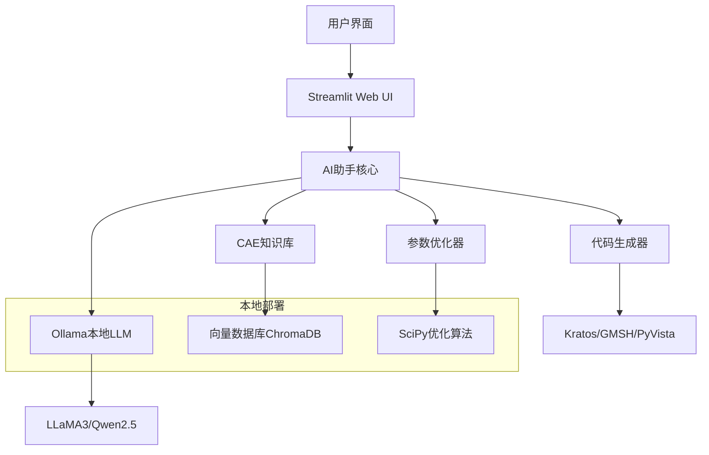

# 🤖 DeepCAD AI Assistant 技术路线图

## 🎯 **总体架构设计**

### **技术栈选择 (个人电脑友好)**


### **🏗️ 核心功能模块**

#### **1. 智能对话引擎**
- **Ollama集成**: 本地LLM推理，支持多模型切换
- **意图识别**: CAE专业领域意图分类
- **提示词工程**: 针对不同CAE任务的专业提示词
- **对话历史管理**: 上下文记忆和会话状态维护

#### **2. CAE专业知识库**
```python
class CAEKnowledgeBase:
    """CAE专业知识库"""
    
    knowledge_domains = {
        "fem_theory": {
            "description": "有限元理论基础",
            "topics": [
                "单元类型与形函数",
                "数值积分方法", 
                "刚度矩阵组装",
                "边界条件处理",
                "非线性求解方法"
            ]
        },
        "material_models": {
            "description": "材料本构模型",
            "topics": [
                "线弹性材料",
                "弹塑性模型",
                "超弹性模型",
                "复合材料",
                "损伤模型"
            ]
        },
        "mesh_generation": {
            "description": "网格生成技术",
            "topics": [
                "结构化网格",
                "非结构化网格",
                "自适应网格细化",
                "网格质量评估",
                "边界层网格"
            ]
        },
        "solver_algorithms": {
            "description": "求解算法",
            "topics": [
                "直接求解器",
                "迭代求解器",
                "预处理技术",
                "并行计算",
                "多物理场耦合"
            ]
        }
    }
```

#### **3. 智能代码生成器**
- **Kratos脚本生成**: 基于用户描述自动生成求解脚本
- **GMSH网格代码**: 参数化网格生成代码
- **PyVista可视化**: 结果后处理和可视化代码
- **代码优化建议**: 性能优化和最佳实践推荐

#### **4. 参数优化助手**
```python
class IntelligentOptimizer:
    """AI驱动的参数优化系统"""
    
    optimization_methods = {
        "bayesian": "贝叶斯优化",
        "genetic": "遗传算法", 
        "particle_swarm": "粒子群优化",
        "gradient_based": "梯度优化",
        "neural_optimization": "神经网络优化"
    }
    
    async def optimize_parameters(self, 
                                objective_function: str,
                                constraints: Dict,
                                design_variables: List):
        # AI分析优化问题
        problem_analysis = await self.ai_analyze_problem(
            objective_function, constraints, design_variables
        )
        
        # 选择最佳优化策略
        strategy = self.select_optimal_strategy(problem_analysis)
        
        # 执行优化并提供实时指导
        result = await self.execute_optimization(strategy)
        
        return result
```

## 🚀 **实施计划**

### **Phase 1: 基础AI引擎 (已完成)**
- ✅ Ollama集成和连接测试
- ✅ 基础意图识别系统
- ✅ CAE专业提示词工程
- ✅ 简单对话测试

### **Phase 2: 知识库构建 (进行中)**
```bash
# 知识库数据源
knowledge_sources = [
    "CAE经典教材PDF解析",
    "Kratos官方文档爬取", 
    "ArXiv CAE相关论文",
    "GitHub CAE项目代码",
    "工程论坛问答数据"
]

# 向量化存储
embedding_pipeline = [
    "文档分块 (chunk_size=512)",
    "向量化 (sentence-transformers)",
    "ChromaDB存储",
    "相似度检索优化"
]
```

### **Phase 3: 代码生成增强**
```python
# 代码生成模板系统
code_templates = {
    "kratos_fem_script": {
        "template": "kratos_fem_template.py",
        "parameters": ["material", "geometry", "boundary_conditions"],
        "validation": "syntax_check + physics_check"
    },
    "gmsh_mesh_script": {
        "template": "gmsh_mesh_template.py", 
        "parameters": ["geometry", "mesh_size", "element_type"],
        "validation": "mesh_quality_check"
    },
    "pyvista_visualization": {
        "template": "pyvista_viz_template.py",
        "parameters": ["data_source", "plot_type", "colormap"],
        "validation": "rendering_check"
    }
}
```

### **Phase 4: 高级功能集成**
- **多模态理解**: 图片上传分析CAE结果
- **实时计算监控**: 集成到现有的DeepCAD优化系统
- **自动错误诊断**: AI分析计算失败原因
- **性能调优建议**: 基于系统状态的优化推荐

## 💻 **本地部署方案**

### **硬件要求评估**
```yaml
minimum_requirements:
  cpu: "4核心 Intel/AMD"
  memory: "16GB RAM"
  storage: "50GB SSD空间"
  gpu: "可选 (NVIDIA RTX系列加速)"

recommended_requirements:
  cpu: "8核心 Intel/AMD" 
  memory: "32GB RAM"
  storage: "100GB NVMe SSD"
  gpu: "NVIDIA RTX 4060/4070 (本地加速)"
```

### **模型选择策略**
```python
model_selection_strategy = {
    # 轻量级模型 (4-8GB RAM)
    "lightweight": {
        "primary": "llama3:8b",
        "chinese": "qwen2.5:7b", 
        "code": "deepseek-coder:6.7b"
    },
    
    # 标准模型 (16-32GB RAM)  
    "standard": {
        "primary": "llama3.1:8b",
        "chinese": "qwen2.5:14b",
        "code": "deepseek-coder:33b"
    },
    
    # 高性能模型 (32GB+ RAM)
    "performance": {
        "primary": "llama3.1:70b",
        "chinese": "qwen2.5:72b", 
        "code": "deepseek-coder:33b"
    }
}
```

### **部署脚本**
```bash
#!/bin/bash
# DeepCAD AI Assistant 一键部署脚本

echo "🚀 开始部署DeepCAD AI Assistant..."

# 1. 检查系统环境
check_system_requirements() {
    echo "📋 检查系统要求..."
    # CPU、内存、硬盘空间检查
}

# 2. 安装Ollama
install_ollama() {
    echo "🔧 安装Ollama..."
    curl -fsSL https://ollama.ai/install.sh | sh
}

# 3. 下载推荐模型
download_models() {
    echo "⬇️ 下载AI模型..."
    ollama pull llama3:latest
    ollama pull qwen2.5:7b
    ollama pull deepseek-coder:6.7b
}

# 4. 安装Python依赖
install_python_deps() {
    echo "🐍 安装Python依赖..."
    pip install -r requirements.txt
}

# 5. 初始化知识库
init_knowledge_base() {
    echo "📚 初始化CAE知识库..."
    python scripts/build_knowledge_base.py
}

# 6. 启动服务
start_services() {
    echo "🚀 启动DeepCAD AI Assistant..."
    streamlit run ai_assistant/streamlit_ui.py --server.port 8501
}

# 执行部署流程
main() {
    check_system_requirements
    install_ollama  
    download_models
    install_python_deps
    init_knowledge_base
    start_services
    
    echo "✅ DeepCAD AI Assistant 部署完成！"
    echo "🌐 访问地址: http://localhost:8501"
}

main "$@"
```

## 🎯 **特色功能设计**

### **1. CAE问题智能诊断**
```python
class CAEProblemDiagnostic:
    """CAE问题智能诊断系统"""
    
    diagnostic_categories = {
        "convergence_issues": {
            "symptoms": ["收敛困难", "发散", "震荡"],
            "analysis_methods": ["残差分析", "能量监控", "位移检查"],
            "solutions": ["时间步调整", "求解器参数", "网格细化"]
        },
        "mesh_quality": {
            "symptoms": ["单元畸变", "负体积", "长宽比过大"],
            "analysis_methods": ["质量指标", "雅可比检查", "角度分析"],
            "solutions": ["网格重划", "光滑算法", "局部细化"]
        },
        "material_modeling": {
            "symptoms": ["应力异常", "变形不合理", "材料失效"],
            "analysis_methods": ["本构关系检查", "参数验证", "实验对比"],
            "solutions": ["模型修正", "参数调整", "多尺度建模"]
        }
    }
    
    async def diagnose_problem(self, 
                             problem_description: str,
                             log_files: List[str],
                             result_data: Optional[Dict]) -> DiagnosticReport:
        # AI分析问题描述
        symptom_analysis = await self.analyze_symptoms(problem_description)
        
        # 日志文件解析
        log_analysis = self.parse_log_files(log_files)
        
        # 结果数据分析
        result_analysis = self.analyze_results(result_data) if result_data else None
        
        # 综合诊断
        diagnosis = self.generate_diagnosis(
            symptom_analysis, log_analysis, result_analysis
        )
        
        # 生成解决方案
        solutions = await self.generate_solutions(diagnosis)
        
        return DiagnosticReport(
            diagnosis=diagnosis,
            confidence=diagnosis.confidence,
            solutions=solutions,
            prevention_tips=self.get_prevention_tips(diagnosis.category)
        )
```

### **2. 智能参数推荐**
```python
class SmartParameterRecommendation:
    """智能参数推荐系统"""
    
    async def recommend_parameters(self, 
                                 problem_type: str,
                                 geometry_info: Dict,
                                 material_properties: Dict,
                                 loading_conditions: Dict) -> ParameterSet:
        
        # AI分析问题特征
        problem_features = await self.extract_problem_features(
            problem_type, geometry_info, material_properties, loading_conditions
        )
        
        # 基于经验数据库推荐
        experience_based = self.query_experience_database(problem_features)
        
        # AI生成个性化建议
        ai_recommendations = await self.generate_ai_recommendations(problem_features)
        
        # 综合推荐结果
        final_recommendations = self.merge_recommendations(
            experience_based, ai_recommendations
        )
        
        return ParameterSet(
            solver_params=final_recommendations.solver,
            mesh_params=final_recommendations.mesh,
            material_params=final_recommendations.material,
            confidence_scores=final_recommendations.confidence,
            explanation=final_recommendations.reasoning
        )
```

### **3. 实时计算指导**
```python
class RealTimeComputationGuide:
    """实时计算指导系统"""
    
    async def monitor_computation(self, computation_id: str):
        """实时监控计算过程并提供指导"""
        
        while computation_is_running(computation_id):
            # 获取当前状态
            status = get_computation_status(computation_id)
            
            # AI分析计算状态
            analysis = await self.analyze_computation_status(status)
            
            # 检测潜在问题
            if analysis.has_issues:
                # 生成实时建议
                suggestions = await self.generate_realtime_suggestions(analysis)
                
                # 发送通知
                self.notify_user(suggestions)
                
                # 可选：自动调整参数
                if suggestions.auto_adjustable:
                    await self.auto_adjust_parameters(computation_id, suggestions)
            
            # 更新监控状态
            self.update_monitoring_dashboard(analysis)
            
            await asyncio.sleep(5)  # 5秒检查一次
```

## 📊 **性能优化策略**

### **推理加速**
```python
optimization_strategies = {
    "model_quantization": {
        "method": "INT8量化",
        "memory_reduction": "50%",
        "speed_improvement": "2x"
    },
    "prompt_caching": {
        "method": "常用提示词缓存",
        "cache_hit_rate": "80%",
        "response_speedup": "3x"
    },
    "batch_processing": {
        "method": "批量推理",
        "throughput_improvement": "4x",
        "use_case": "批量代码生成"
    },
    "streaming_response": {
        "method": "流式输出",
        "user_experience": "实时感",
        "perceived_speed": "2x"
    }
}
```

### **内存管理**
```python
memory_optimization = {
    "model_loading": {
        "strategy": "按需加载",
        "implementation": "lazy loading + LRU cache",
        "memory_saving": "60%"
    },
    "knowledge_base": {
        "strategy": "向量索引优化", 
        "implementation": "FAISS + 分层检索",
        "query_speed": "10x faster"
    },
    "conversation_history": {
        "strategy": "滑动窗口",
        "implementation": "保留最近20轮对话",
        "memory_bounded": "固定内存使用"
    }
}
```

## 🔮 **未来扩展计划**

### **多模态能力**
- **图像理解**: 上传CAE结果图，AI自动分析
- **3D模型理解**: 直接分析几何模型文件
- **语音交互**: 语音命令生成CAE代码
- **手绘草图**: 将手绘转换为几何模型

### **协作功能**
- **团队知识库**: 团队共享的CAE经验库
- **代码协作**: 多人协作的代码生成和优化
- **远程诊断**: 远程CAE问题诊断和解决
- **教学模式**: CAE理论教学和实践指导

### **企业集成**
- **PLM系统集成**: 与PDM/PLM系统数据交换
- **HPC集群支持**: 大规模并行计算任务管理
- **质量管理**: CAE计算质量控制和审核
- **标准化流程**: 企业CAE流程标准化和自动化

---

**🎯 目标**: 打造业界领先的个人CAE AI助手，让每个工程师都拥有专业的AI伙伴！

**🚀 愿景**: 通过AI技术降低CAE学习门槛，提高工程分析效率，推动仿真技术普及！