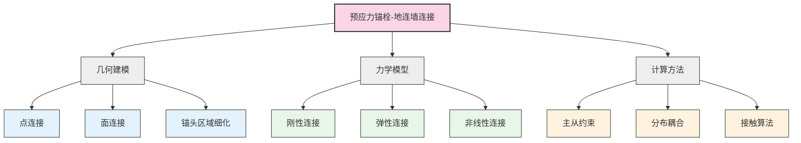

```mermaid
flowchart TD
    A["预应力锚栓-地连墙连接"] --> B["几何建模"]
    A --> C["力学模型"]
    A --> D["计算方法"]
    
    B --> B1["点连接"]
    B --> B2["面连接"]
    B --> B3["锚头区域细化"]
    
    C --> C1["刚性连接"]
    C --> C2["弹性连接"]
    C --> C3["非线性连接"]
    
    D --> D1["主从约束"]
    D --> D2["分布耦合"]
    D --> D3["接触算法"]

    classDef root fill:#f9d5e5,stroke:#333,stroke-width:2px
    classDef category fill:#eeeeee,stroke:#333,stroke-width:1px
    classDef type1 fill:#e3f2fd,stroke:#333,stroke-width:1px
    classDef type2 fill:#e8f5e9,stroke:#333,stroke-width:1px
    classDef type3 fill:#fff3e0,stroke:#333,stroke-width:1px
    
    class A root
    class B,C,D category
    class B1,B2,B3 type1
    class C1,C2,C3 type2
    class D1,D2,D3 type3
``` 