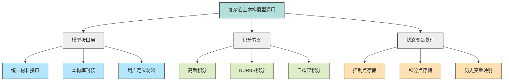

```mermaid
flowchart TD
    A["复杂岩土本构模型调用"] --> B["模型接口层"]
    A --> C["积分方案"]
    A --> D["状态变量处理"]
    
    B --> B1["统一材料接口"]
    B --> B2["本构库封装"]
    B --> B3["用户定义材料"]
    
    C --> C1["高斯积分"]
    C --> C2["NURBS积分"]
    C --> C3["自适应积分"]
    
    D --> D1["控制点存储"]
    D --> D2["积分点存储"]
    D --> D3["历史变量映射"]
    
    classDef root fill:#b2dfdb,stroke:#333,stroke-width:2px
    classDef category fill:#eeeeee,stroke:#333,stroke-width:1px
    classDef type1 fill:#b3e5fc,stroke:#333,stroke-width:1px
    classDef type2 fill:#dcedc8,stroke:#333,stroke-width:1px
    classDef type3 fill:#ffe0b2,stroke:#333,stroke-width:1px
    
    class A root
    class B,C,D category
    class B1,B2,B3 type1
    class C1,C2,C3 type2
    class D1,D2,D3 type3
``` 