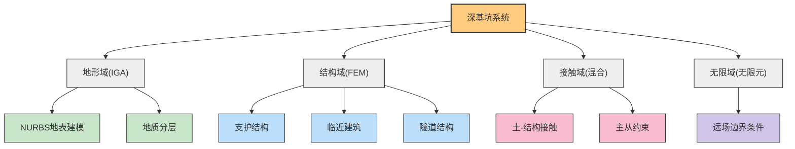

```mermaid
flowchart TD
    A["深基坑系统"] --> B["地形域(IGA)"]
    A --> C["结构域(FEM)"]
    A --> D["接触域(混合)"]
    A --> E["无限域(无限元)"]
    B --> F["NURBS地表建模"]
    B --> G["地质分层"]
    C --> H["支护结构"]
    C --> I["临近建筑"]
    C --> J["隧道结构"]
    D --> K["土-结构接触"]
    D --> L["主从约束"]
    E --> M["远场边界条件"]
    
    classDef root fill:#ffcc80,stroke:#333,stroke-width:2px
    classDef domain fill:#eeeeee,stroke:#333,stroke-width:1px
    classDef terrain fill:#c8e6c9,stroke:#333,stroke-width:1px
    classDef structure fill:#bbdefb,stroke:#333,stroke-width:1px
    classDef contact fill:#f8bbd0,stroke:#333,stroke-width:1px
    classDef infinite fill:#d1c4e9,stroke:#333,stroke-width:1px
    
    class A root
    class B,C,D,E domain
    class F,G terrain
    class H,I,J structure
    class K,L contact
    class M infinite
``` 