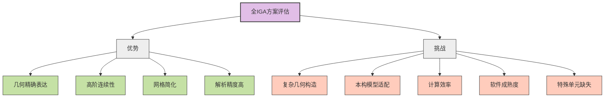

```mermaid
flowchart TD
    A["全IGA方案评估"] --> B["优势"]
    A --> C["挑战"]
    
    B --> B1["几何精确表达"]
    B --> B2["高阶连续性"]
    B --> B3["网格简化"]
    B --> B4["解析精度高"]
    
    C --> C1["复杂几何构造"]
    C --> C2["本构模型适配"]
    C --> C3["计算效率"]
    C --> C4["软件成熟度"]
    C --> C5["特殊单元缺失"]
    
    classDef root fill:#e1bee7,stroke:#333,stroke-width:2px
    classDef category fill:#eeeeee,stroke:#333,stroke-width:1px
    classDef advantage fill:#c5e1a5,stroke:#333,stroke-width:1px
    classDef challenge fill:#ffccbc,stroke:#333,stroke-width:1px
    
    class A root
    class B,C category
    class B1,B2,B3,B4 advantage
    class C1,C2,C3,C4,C5 challenge
``` 