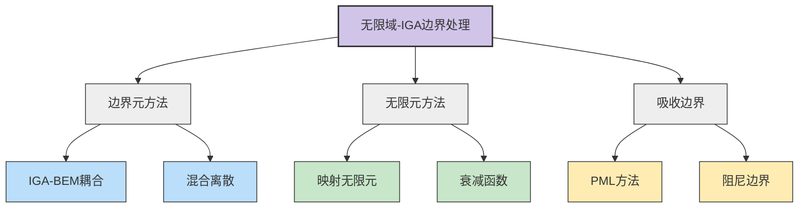

```mermaid
flowchart TD
    A["无限域-IGA边界处理"] --> B["边界元方法"]
    A --> C["无限元方法"]
    A --> D["吸收边界"]
    
    B --> B1["IGA-BEM耦合"]
    B --> B2["混合离散"]
    
    C --> C1["映射无限元"]
    C --> C2["衰减函数"]
    
    D --> D1["PML方法"]
    D --> D2["阻尼边界"]
    
    classDef root fill:#d1c4e9,stroke:#333,stroke-width:2px
    classDef category fill:#eeeeee,stroke:#333,stroke-width:1px
    classDef type1 fill:#bbdefb,stroke:#333,stroke-width:1px
    classDef type2 fill:#c8e6c9,stroke:#333,stroke-width:1px
    classDef type3 fill:#ffecb3,stroke:#333,stroke-width:1px
    
    class A root
    class B,C,D category
    class B1,B2 type1
    class C1,C2 type2
    class D1,D2 type3
``` 