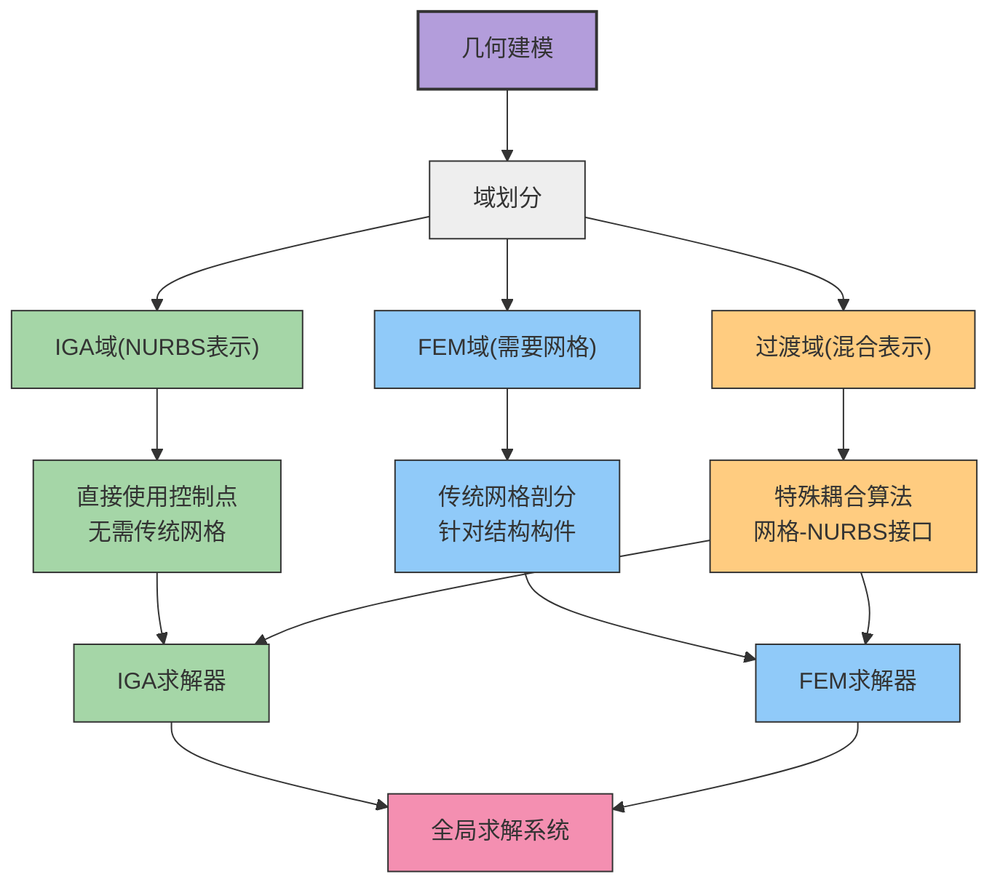

```mermaid
flowchart TD
    A["几何建模"] --> B["域划分"]
    B --> C["IGA域(NURBS表示)"]
    B --> D["FEM域(需要网格)"]
    B --> E["过渡域(混合表示)"]
    C --> F["直接使用控制点<br/>无需传统网格"]
    D --> G["传统网格剖分<br/>针对结构构件"]
    E --> H["特殊耦合算法<br/>网格-NURBS接口"]
    F --> I["IGA求解器"]
    G --> J["FEM求解器"]
    H --> I
    H --> J
    I --> K["全局求解系统"]
    J --> K
    
    classDef root fill:#b39ddb,stroke:#333,stroke-width:2px
    classDef level1 fill:#eeeeee,stroke:#333,stroke-width:1px
    classDef iga fill:#a5d6a7,stroke:#333,stroke-width:1px
    classDef fem fill:#90caf9,stroke:#333,stroke-width:1px
    classDef hybrid fill:#ffcc80,stroke:#333,stroke-width:1px
    classDef solver fill:#f48fb1,stroke:#333,stroke-width:1px
    
    class A root
    class B level1
    class C,F,I iga
    class D,G,J fem
    class E,H hybrid
    class K solver
``` 