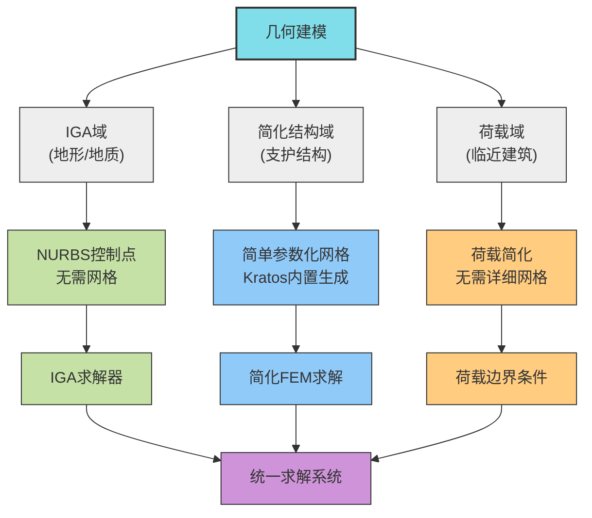

```mermaid
flowchart TD
    A["几何建模"] --> B["IGA域<br/>(地形/地质)"]
    A --> C["简化结构域<br/>(支护结构)"]
    A --> D["荷载域<br/>(临近建筑)"]
    
    B --> E["NURBS控制点<br/>无需网格"]
    C --> F["简单参数化网格<br/>Kratos内置生成"]
    D --> G["荷载简化<br/>无需详细网格"]
    
    E --> H["IGA求解器"]
    F --> I["简化FEM求解"]
    G --> J["荷载边界条件"]
    
    H --> K["统一求解系统"]
    I --> K
    J --> K
    
    classDef root fill:#80deea,stroke:#333,stroke-width:2px
    classDef domain fill:#eeeeee,stroke:#333,stroke-width:1px
    classDef iga fill:#c5e1a5,stroke:#333,stroke-width:1px
    classDef fem fill:#90caf9,stroke:#333,stroke-width:1px
    classDef load fill:#ffcc80,stroke:#333,stroke-width:1px
    classDef solver fill:#ce93d8,stroke:#333,stroke-width:1px
    
    class A root
    class B,C,D domain
    class E,H iga
    class F,I fem
    class G,J load
    class K solver
``` 