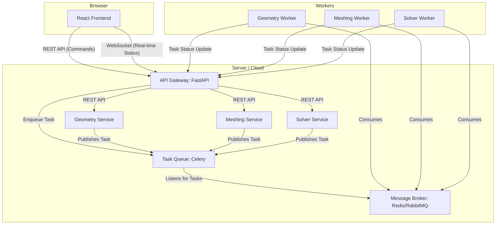

# DeepCAD 核心技术路线 V1.0

本文档旨在阐述 DeepCAD 项目在核心计算与交互层面的技术选型、架构设计与实施策略。

## 1. 总体架构

DeepCAD 采用基于微服务的前后端分离架构。

-   **前端 (Frontend)**: 基于 **React** 的现代化单页应用 (SPA)，负责所有用户交互、三维场景渲染和状态展示。
-   **后端 (Backend)**: 基于 **Python** 的一系列微服务，通过 **FastAPI** 构建，负责处理几何、网格、求解等核心计算任务。
-   **通信 (Communication)**: 前后端通过 **RESTful API** 进行指令交互，并通过 **WebSocket** 实现长时任务的实时状态推送。

---

## 2. 核心技术栈详解

### 2.1 前端: React Three Fiber (r3f)

**选型理由**:
r3f 提供了将强大的 Three.js 库以声明式、组件化的方式融入 React 生态的能力，是构建复杂、交互式三维场景的首选。

**关键实践**:

1.  **大规模模型渲染**:
    -   **几何体复用 (Instancing)**: 对于场景中任何重复的几何体，必须使用 `<instancedMesh>` 来将绘制调用(Draw Call)降至最低。
    -   **细节层次 (LOD - Level of Detail)**: 对复杂模型（如设备、车辆）提供高、中、低三种精度的模型，并使用 `@react-three/drei` 中的 `<Detailed>` 组件，根据模型与相机的距离自动切换，显著降低远景物体的顶点数量。
    -   **八叉树/空间划分**: 对于百万级单元的 CAE 网格，必须采用八叉树等空间划分技术，确保只渲染相机视锥体内的部分，避免一次性加载整个模型。

2.  **性能优化**:
    -   **按需渲染 (`frameloop="demand"`)**: 在无用户交互的静态场景下，暂停渲染循环，仅在相机变化或需要更新时手动触发，极大降低 GPU 负担。
    -   **性能监控 (`<Perf />`)**: 在开发阶段，使用 `<Perf>` 组件实时监控 FPS、Draw Call 和内存占用，主动发现性能瓶颈。
    -   **模型预处理**: 所有 GLTF/GLB 模型必须经过 `gltfjsx` 工具进行 Draco 压缩和 Web 优化，将文件体积减至最小。

3.  **云图可视化**:
    -   通过直接操作 `BufferGeometry` 的 `color` 属性来更新云图数据，避免重新创建几何体。
    -   对于复杂的标量场和矢量场，将采用自定义着色器 (Shader) 来实现高性能、高保真的可视化效果。

### 2.2 后端 API: FastAPI

**选型理由**:
FastAPI 拥有极高的性能、原生的异步支持、便捷的数据校验和自动化的 API 文档，是构建现代 Python 后端的理想选择。

**关键实践**:

1.  **异步与长时任务**:
    -   **Celery 集成**: 所有耗时超过 1 秒的计算任务（几何处理、网格划分、求解计算），**必须** 通过 Celery 异步执行。FastAPI 接口在接收到请求后，应立即将任务发布到消息队列（如 Redis 或 RabbitMQ），并返回一个 `task_id`。
    -   **后台 Worker**: 独立的 Celery Worker 进程负责消费队列中的任务，与 Web 服务进程完全解耦，保证了系统的可扩展性和健壮性。

2.  **实时状态通信**:
    -   **WebSocket**: 必须使用 WebSocket 在前端和后端之间建立持久连接。当 Worker 执行任务时（例如，网格划分进行到 50%），它会通过一个内部通道将进度更新报告给 FastAPI 服务，FastAPI 再通过 WebSocket 将该状态实时推送给前端。这为用户提供了流畅、透明的实时进度反馈。

### 2.3 几何与网格: Gmsh (OpenCASCADE Kernel)

**选型理由**:
Gmsh 是一个强大、开源且功能丰富的三维有限元网格生成器。其内置的 OpenCASCADE (OCC) 内核提供了完整的 CAD 功能，而其 Python API 则允许我们以全自动、参数化的方式完成所有几何与网格操作。

**核心原则**:
**我们将完全、唯一地依赖 Gmsh 的 Python API 及其内置的 OCC 内核** 来处理所有几何任务，**不引入**其他任何第三方几何库（如 `python-occ`），确保数据流的统一、简洁和高效。

**工作流程**:

1.  **加载/创建几何**:
    -   通过 `gmsh.model.occ.importShapes()` 直接加载用户上传的 STEP 或 DXF 文件。
    -   通过 `gmsh.model.occ.addBox()`, `addCylinder()` 等函数以参数化方式创建基础几何体。
2.  **几何操作**:
    -   使用 `gmsh.model.occ.cut()`, `fuse()`, `intersect()` 等布尔运算来执行如“基坑开挖”等核心操作。
3.  **边界标记**:
    -   在几何操作后，调用 `gmsh.model.occ.synchronize()`。
    -   通过 `getEntities()` 和 `getCenterOfMass()` 等方法，自动识别出如“地表”、“开挖面”、“支撑结构”等关键边界。
    -   使用 `addPhysicalGroup()` 对这些边界进行命名和标记。这些标记将直接传递给后续的求解器用于施加荷载和边界条件。
4.  **网格生成**:
    -   利用 `gmsh.model.mesh.field` 功能实现高级网格尺寸控制。例如，使用 `Distance` 和 `Threshold` 场，实现靠近开挖面区域网格加密，远离区域网格稀疏的渐变效果。
    -   调用 `gmsh.model.mesh.generate(3)` 生成三维网格。
5.  **输出**:
    -   将生成的网格以 `.msh` 格式输出，供求解器服务使用。

### 2.4 求解器: Kratos Multiphysics

**选型理由**:
Kratos 是一个开源的多物理场仿真框架，其最大的优势在于其完全面向对象的 C++ 内核和高度可扩展的 Python 上层封装。这使得我们可以用 Python 脚本灵活地驱动和控制复杂的仿真流程。

**关键实践**:

1.  **Python 驱动**: 所有的仿真流程都将通过 Python 脚本来定义。一个典型的脚本包含以下步骤：
    *   导入 `KratosMultiphysics` 核心模块及相关应用模块（如 `StructuralMechanicsApplication`）。
    *   创建 `Model` 对象，并构建 `ModelPart` 来管理不同的模型部件。
    *   使用 `MshFileIO` 读取由 Gmsh 服务生成的 `.msh` 网格文件。
    *   为不同的 `ModelPart` （对应 Gmsh 中的物理组）赋予材料属性和本构关系。
    *   添加求解策略 (Solving Strategy)、线性求解器 (Linear Solver) 和构建器 (Builder)。
    *   定义荷载和边界条件，并将它们应用到指定的 `ModelPart` 上。
    *   运行求解循环。
    *   使用输出模块（如 `VtkOutput` 或 `JsonOutput`）将结果输出。
2.  **服务化封装**: Kratos 的 Python 脚本将被封装在求解器微服务中，由 Celery Worker 触发执行。

---

## 3. 总结

本技术路线旨在构建一个专业、高效、可扩展的现代化 CAE 平台。通过结合 React Three Fiber 的前端渲染能力、FastAPI + Celery 的后端异步处理能力，以及 Gmsh 和 Kratos 的核心计算能力，我们可以为用户提供一个流畅、实时、强大的在线设计与仿真体验。 