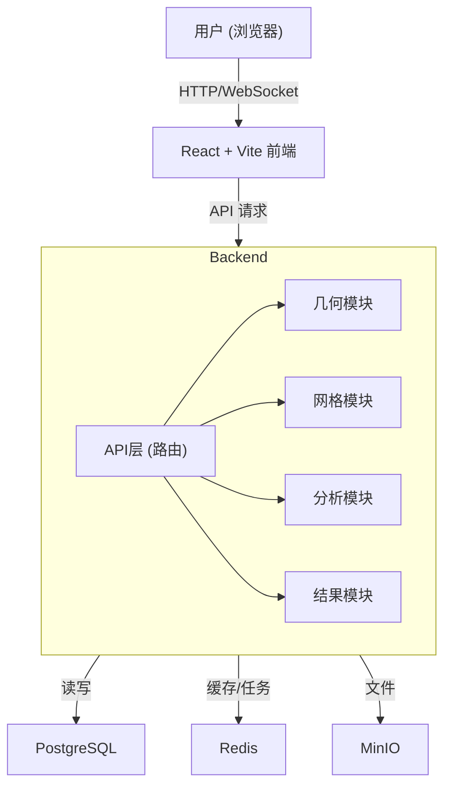

# “新朱雀”架构技术指南 (v2.0 - 本地优先版)

## 1. 架构概述

### 1.1. 核心理念

“新朱雀”架构是为 **单人快速开发和迭代** 而设计的轻量化、本地优先的后端架构。它摒弃了复杂的微服务和容器化部署，回归到一个 **统一的单体应用**，旨在实现最高的开发效率、最简便的部署和最直接的调试体验。

**核心原则:**
*   **本地优先**: 所有开发和调试都在本地直接进行，无需任何容器。
*   **单体应用**: 所有后端逻辑在一个进程中运行，消除服务间通信的复杂性。
*   **逻辑模块化**: 代码结构上保持清晰的模块划分，易于维护和扩展。
*   **快速迭代**: 利用热重载技术，实现代码修改后的即时反馈。

### 1.2. 架构图



## 2. 技术栈

*   **核心框架**: `FastAPI` - 用于构建高性能的API。
*   **Web服务器**: `Uvicorn` - 一个ASGI服务器，开发时支持热重载。
*   **数据库**: `PostgreSQL` - 用于存储项目、用户等结构化数据。
*   **ORM**: `SQLAlchemy` - Python的SQL工具包和对象关系映射器。
*   **对象存储**: `MinIO` - 用于存储如DXF、模型、结果等大文件。
*   **缓存/任务队列**: `Redis` - 用于缓存常用数据和处理后台长时任务（可选，通过Celery集成）。
*   **环境管理**: Python `venv` + `requirements.txt`。

## 3. 项目结构

```
DeepCAD/
├── gateway/
│   ├── main.py           # 统一的FastAPI应用入口
│   ├── requirements.txt    # 所有后端依赖
│   ├── core/
│   │   └── db.py         # 数据库会话管理
│   ├── modules/          # 核心业务模块
│   │   ├── __init__.py
│   │   ├── geometry.py
│   │   ├── meshing.py
│   │   ├── analysis.py
│   │   └── ...
│   └── schemas/          # Pydantic模型
│       ├── geometry.py
│       └── ...
├── docs/
└── scripts/
    └── start_dev.ps1      # 一键启动开发环境脚本
```

## 4. 核心模块详解

所有业务逻辑都作为模块被导入到主 `main.py` 文件中，并注册为API路由。

### 4.1. 几何模块 (`modules/geometry.py`)
*   **职责**: 处理几何模型的创建、修改、导入（DXF）、布尔运算等。
*   **依赖**: `Gmsh` (及其内置的OpenCASCADE内核)。

### 4.2. 网格模块 (`modules/meshing.py`)
*   **职责**: 基于几何模型生成计算网格。
*   **依赖**: `Gmsh`。

### 4.3. 分析模块 (`modules/analysis.py`)
*   **职责**: 调用Kratos进行数值计算。
*   **依赖**: `KratosMultiphysics`。

## 5. 开发与部署

### 5.1. 本地开发工作流
1.  **环境准备**:
    *   在本地安装并启动 `PostgreSQL`, `MinIO`, `Redis`。
    *   创建并激活Python虚拟环境 (`python -m venv .venv`)。
    *   安装所有依赖 (`pip install -r gateway/requirements.txt`)。
2.  **一键启动**:
    *   运行开发脚本 `scripts/start_dev.ps1`，该脚本会启动后端`Uvicorn`服务和前端`Vite`开发服务器。
3.  **编码与调试**:
    *   直接修改 `gateway/modules/` 下的Python文件。`Uvicorn`的热重载功能会自动重启服务器。
    *   可以直接在VS Code或PyCharm中对后端代码设置断点进行调试。

### 5.2. 生产环境部署
*   **应用服务器**: 使用 `Gunicorn` 作为WSGI服务器来运行FastAPI应用，因为它比`Uvicorn`更适合生产环境。
*   **反向代理**: 使用 `Nginx` 作为反向代理，处理HTTPS、静态文件和请求负载。
*   **进程管理**: 使用 `systemd` 创建服务，来管理Gunicorn进程，确保其稳定运行和开机自启。

## 6. 总结

“新朱雀”架构是一个务实、高效的选择，完美契合当前项目的核心需求。它通过简化架构，将开发者的精力从复杂的运维和部署中解放出来，使其能完全专注于产品功能的快速实现和迭代。 