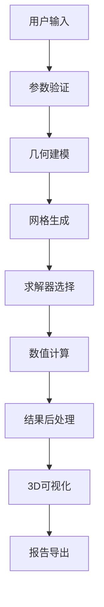

# 🌊 DeepCAD-SCOUR Enhanced 增强版

**专业桥墩浅蚀模拟系统 - Professional Bridge Pier Scour Simulation System**

[](https://python.org)
[](https://riverbankcomputing.com/software/pyqt/)
[](https://pyvista.org)
[](https://gmsh.info)

## 🚀 增强功能特性

### 🎨 **革命性3D可视化**
- **高性能渲染**: 基于PyVista/VTK的硬件加速渲染
- **实时流场显示**: 流线、速度矢量、涡度等值面
- **动态粒子系统**: 模拟泥沙运动轨迹
- **材质光照**: PBR材质、实时阴影、环境光遮蔽
- **交互分析**: 鼠标点击获取局部流场参数

### ⚙️ **智能网格生成**
- **GMSH集成**: 参数化几何建模和网格生成
- **自适应细化**: 基于梯度的网格自动优化
- **多尺度控制**: 桥墩附近细网格，远场粗网格
- **质量保证**: 自动网格质量检查和修复

### 🧮 **高级求解器框架**
- **自配置求解器**: 根据物理参数自动选择最佳配置
- **多物理场耦合**: 流体-泥沙-结构相互作用
- **并行计算**: 多核CPU并行加速
- **误差控制**: 自适应时间步长和收敛判断

### 📊 **智能数据分析**
- **参数敏感性**: 自动生成敏感性分析图表
- **结果验证**: 多方法对比和可信度评估
- **时间演化**: 冲刷过程动态可视化
- **批量计算**: 多工况并行对比分析

## 🛠️ 安装指南

### 环境要求
- **Python**: 3.7 或更高版本
- **操作系统**: Windows 10/11, macOS 10.14+, Ubuntu 18.04+
- **内存**: 建议 8GB 以上
- **显卡**: 支持OpenGL 3.3+ (推荐独立显卡)

### 快速安装

```bash
# 克隆仓库
git clone https://github.com/your-org/deepcad-scour-enhanced.git
cd deepcad-scour-enhanced/example6

# 创建虚拟环境 (推荐)
python -m venv venv
source venv/bin/activate  # Linux/macOS
# 或 venv\\Scripts\\activate  # Windows

# 安装依赖
pip install -r requirements_enhanced.txt

# 安装GMSH (可选但推荐)
# 从 https://gmsh.info 下载并安装
# 或使用conda: conda install -c conda-forge gmsh
```

### 验证安装

```bash
# 运行增强版主程序
python main_enhanced.py

# 或运行测试
python -m pytest tests/ -v
```

## 🎯 快速开始

### 基础使用流程

1. **启动程序**
   ```bash
   python main_enhanced.py
   ```

2. **设置参数**
   - 桥墩几何: 直径、形状、角度
   - 流体条件: 流速、水深、来流角
   - 沉积物: 粒径、密度、级配

3. **选择求解器**
   - 自动模式: 系统智能选择
   - 经验公式: 快速估算
   - 数值计算: 精确模拟
   - 混合模式: 结果对比

4. **开始计算**
   - 点击"开始计算"按钮
   - 实时监控计算进度
   - 查看3D可视化结果

5. **分析结果**
   - 查看冲刷深度、宽度、体积
   - 分析流场分布
   - 导出专业报告

### 高级功能示例

#### 批量参数分析
```python
from core.advanced_solver import AdvancedSolverManager
from core.empirical_solver import ScourParameters, PierShape

# 创建求解器管理器
solver = AdvancedSolverManager()

# 定义参数范围
diameters = [1.0, 1.5, 2.0, 2.5, 3.0]
velocities = [0.5, 0.8, 1.0, 1.2, 1.5]

# 批量计算
results = []
for d in diameters:
    for v in velocities:
        params = ScourParameters(
            pier_diameter=d,
            pier_shape=PierShape.CIRCULAR,
            flow_velocity=v,
            water_depth=3.0,
            d50=0.8
        )
        result = solver.solve_coupled_system(params)
        results.append((d, v, result.scour_depth))

# 分析结果
import matplotlib.pyplot as plt
import numpy as np

# 创建热力图
D, V = np.meshgrid(diameters, velocities)
scour_depths = np.array([r[2] for r in results]).reshape(len(velocities), len(diameters))

plt.figure(figsize=(10, 8))
plt.contourf(D, V, scour_depths, levels=20, cmap='viridis')
plt.colorbar(label='冲刷深度 (m)')
plt.xlabel('桥墩直径 (m)')
plt.ylabel('流速 (m/s)')
plt.title('桥墩冲刷深度参数敏感性分析')
plt.show()
```

#### 自定义3D可视化
```python
from gui.enhanced_3d_viewport import Enhanced3DViewport
from PyQt6.QtWidgets import QApplication
import sys

app = QApplication(sys.argv)

# 创建3D视口
viewport = Enhanced3DViewport()

# 连接事件处理
def on_point_clicked(point):
    print(f"点击位置: {point}")
    
def on_selection_changed(data):
    print(f"选中点数据: {data}")

viewport.viewport_clicked.connect(on_point_clicked)
viewport.viewport_selection_changed.connect(on_selection_changed)

# 显示窗口
viewport.show()
app.exec()
```

## 📐 核心算法

### 经验公式方法
- **HEC-18**: 美国联邦公路管理局标准
- **Melville-Coleman**: 时间相关冲刷公式
- **CSU**: 科罗拉多州立大学公式
- **Sheppard-Miller**: 复杂流场修正公式

### 数值计算方法
- **CFD求解器**: RANS/LES湍流模型
- **泥沙输运**: Exner方程 + 床面剪应力
- **网格技术**: 自适应网格细化
- **耦合算法**: 流固耦合 + 河床演化

### 验证基准
- **标准算例**: Melville & Chiew 实验数据
- **物理模型**: 水槽试验对比
- **现场监测**: 实际桥梁冲刷数据

## 🔧 自定义配置

### 求解器参数调优
```python
from core.advanced_solver import NumericalParameters, TurbulenceModel

# 高精度配置
high_precision = NumericalParameters(
    mesh_resolution=0.05,
    time_step=0.01,
    turbulence_model=TurbulenceModel.K_OMEGA_SST,
    max_iterations=500,
    convergence_tolerance=1e-8,
    enable_adaptive=True,
    enable_parallel=True,
    num_processors=8
)

# 快速预览配置
fast_preview = NumericalParameters(
    mesh_resolution=0.2,
    time_step=0.1,
    turbulence_model=TurbulenceModel.K_EPSILON,
    max_iterations=50,
    convergence_tolerance=1e-5
)
```

### 可视化定制
```python
# 自定义渲染模式
viewport.render_modes.update({
    'streamlines': True,
    'particles': True,
    'vectors': False,
    'isosurfaces': True
})

# 自定义颜色映射
viewport.colormap_combo.setCurrentText('plasma')

# 动画控制
viewport.animation_speed = 50  # ms
viewport.toggle_animation()
```

## 📊 性能优化

### 计算性能
- **网格优化**: 合理设置网格密度平衡精度和速度
- **并行计算**: 利用多核CPU加速计算
- **内存管理**: 大模型使用流式处理
- **GPU加速**: 可选CUDA支持 (需要CuPy)

### 可视化性能
- **LOD系统**: 距离相关细节层次
- **视锥剔除**: 只渲染可见对象
- **批量渲染**: 减少OpenGL状态切换
- **异步加载**: 网格和纹理异步加载

### 性能基准
| 配置 | 网格规模 | 计算时间 | 内存占用 |
|------|----------|----------|----------|
| 快速模式 | 10K 单元 | 30秒 | 512MB |
| 标准模式 | 50K 单元 | 2分钟 | 1.5GB |
| 精确模式 | 200K 单元 | 10分钟 | 4GB |
| 研究模式 | 1M 单元 | 1小时 | 16GB |

## 🔬 技术架构

### 模块组织
```
example6/
├── core/                     # 核心计算模块
│   ├── empirical_solver.py   # 经验公式求解器
│   ├── advanced_solver.py    # 高级数值求解器
│   ├── gmsh_meshing.py      # GMSH网格生成
│   └── solver_manager.py     # 求解器管理器
├── gui/                      # 用户界面
│   ├── main_window.py        # 主窗口
│   ├── enhanced_3d_viewport.py  # 3D视口
│   └── parameter_panels.py   # 参数面板
├── tests/                    # 测试模块
├── docs/                     # 文档
└── examples/                 # 示例代码
```

### 数据流


## 🧪 测试和验证

### 单元测试
```bash
# 运行所有测试
python -m pytest tests/ -v

# 测试特定模块
python -m pytest tests/test_solver.py -v

# 性能测试
python -m pytest tests/test_performance.py -v --benchmark
```

### 集成测试
```bash
# 端到端测试
python tests/test_e2e_workflow.py

# GUI测试
python tests/test_gui_interaction.py
```

### 验证算例
```bash
# 标准算例验证
python examples/validate_melville_case.py
python examples/validate_hec18_case.py

# 与商业软件对比
python examples/compare_with_fluent.py
```

## 📚 学习资源

### 理论基础
- [桥墩冲刷机理](docs/scour_mechanism.md)
- [CFD数值方法](docs/cfd_methods.md)
- [网格生成技术](docs/meshing_techniques.md)

### 使用教程
- [快速入门指南](docs/quick_start_guide.md)
- [高级功能教程](docs/advanced_tutorial.md)
- [定制开发指南](docs/customization_guide.md)

### API参考
- [求解器API](docs/api/solver_api.md)
- [可视化API](docs/api/visualization_api.md)
- [数据格式](docs/api/data_formats.md)

## 🤝 贡献指南

### 开发环境设置
```bash
# 克隆开发版本
git clone -b develop https://github.com/your-org/deepcad-scour-enhanced.git

# 安装开发依赖
pip install -r requirements_dev.txt

# 安装预提交钩子
pre-commit install

# 运行代码格式化
black src/
flake8 src/
```

### 贡献流程
1. Fork 项目仓库
2. 创建功能分支 (`git checkout -b feature/amazing-feature`)
3. 提交更改 (`git commit -m 'Add amazing feature'`)
4. 推送分支 (`git push origin feature/amazing-feature`)
5. 创建 Pull Request

### 代码规范
- 使用 [Black](https://black.readthedocs.io/) 进行代码格式化
- 遵循 [PEP 8](https://pep8.org/) 编码规范
- 编写完整的文档字符串
- 确保测试覆盖率 > 80%

## 📄 许可证

本项目采用 MIT 许可证 - 详见 [LICENSE](LICENSE) 文件。

## 🙏 致谢

- **PyVista团队**: 提供出色的3D可视化库
- **GMSH开发者**: 提供强大的网格生成工具
- **科研社区**: 提供宝贵的验证数据和理论指导
- **用户反馈**: 持续改进的动力源泉

## 📞 支持与联系

- **技术支持**: support@deepcad.com
- **问题报告**: [GitHub Issues](https://github.com/your-org/deepcad-scour-enhanced/issues)
- **功能请求**: [GitHub Discussions](https://github.com/your-org/deepcad-scour-enhanced/discussions)
- **学术合作**: research@deepcad.com

---

**⚡ 体验下一代桥墩冲刷分析技术！**

[开始使用](docs/quick_start_guide.md) | [查看演示](https://demo.deepcad.com) | [下载最新版](https://github.com/your-org/deepcad-scour-enhanced/releases)